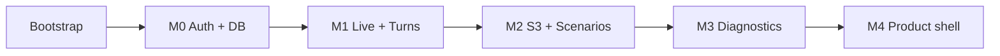

# Camille — Implementation Plan

**Version:** 1.2  
**Aligned with:** [PRD v2.1](./PRD.md)  
**Purpose:** Ordered, actionable tasks to start coding. Use checkboxes in your tracker or convert to GitHub Issues / Linear.

**Conventions**

- **Task IDs** — `P0-T01` (phase 0), `M0-T03` (milestone 0), etc.  
- **Deps** — `→` means “blocked until … completes”.  
- **ADR** — short architecture decision record in `docs/adr/` when noted.

### Progress (as of 2026-04-28)

| Phase            | Status |
| ---------------- | ------ |
| P0 — Bootstrap   | Done   |
| M0 — Foundation  | Done   |
| M1 — Live + turns | **Mostly done** — server token, `PracticeSession` APIs, `(app)/live/[sessionId]` client (Google GenAI Web), turn persistence, dashboard “Begin”. **Remaining for full M1 acceptance:** wire **microphone → Live** (M1-T06), optional **debounced batch flush** (M1-T07 uses turn boundaries today), manual ≥60s test. See `docs/adr/002-browser-audio-live.md`. |
| M2 — Audio + UX | **In progress** — presign API, `useSessionRecorder`, mic pre-session + VU, scenarios grid + filters, live shell (timer, gloss, captions, help stubs), complete + transcript pages, `MAX_SESSION_MINUTES` on token mint, single-chunk finalize + ADR-003. **Follow-up:** multi-chunk remux worker, full concat before M3, S3 lifecycle in infra. |

---

## 0. How phases map to PRD milestones


| This plan               | PRD §15 | Outcome                                                             |
| ----------------------- | ------- | ------------------------------------------------------------------- |
| **Phase 0** — Bootstrap | (prep)  | Repo, tooling, env template, CI skeleton                            |
| **Phase 1 (M0)**        | M0      | Auth, DB, marketing shell, protected app layout                     |
| **Phase 2 (M1)**        | M1      | Realtime token + Gemini Live + turns in DB                          |
| **Phase 3 (M2)**        | M2      | S3 audio, concat, scenarios, pre-session, end flow                  |
| **Phase 4 (M3)**        | M3      | Diagnostics Azure + Gemini, job runner, results UI                  |
| **Phase 5 (M4)**        | M4      | Home, history, progress, settings, gloss, avatar, export, hardening |


**Must-ship for v1.0** — PRD §8 — ends at end of Phase 4 + minimal Phase 5 (shell pages that already exist get polished). “Should / Could” items are tagged **[Should]** / **[Could]**.

---

## 1. Suggested repository layout (Next.js 16 App Router)

Create when bootstrapping (adjust names if you prefer feature folders):

```text
app/
  (marketing)/
    page.tsx                 # landing
    privacy/page.tsx
    terms/page.tsx
  (app)/
    layout.tsx               # auth gate + AppNav
    page.tsx                 # home
    scenarios/page.tsx
    session/[sessionId]/page.tsx
    history/...
    progress/...
    settings/page.tsx
  api/
    auth/[...all]/route.ts   # Better Auth handler (pattern per docs)
    realtime/token/route.ts
    audio/presign/route.ts
    sessions/route.ts
    sessions/[id]/route.ts
    sessions/[id]/turns/route.ts
    sessions/[id]/diagnose/route.ts
    cron/diagnostics/route.ts   # if using Vercel Cron
lib/
  db.ts                      # Prisma client singleton
  auth.ts                    # Better Auth server config
  providers/
    conversation.ts
    gemini-live.ts
    pronunciation.ts
    azure-speech-pronunciation.ts
  diagnostics/
    grammar.ts
    vocabulary.ts            # optional second pass
  scenarios/
    seed.ts                  # metadata + prompt template ids
  prompts/
    system-base.ts
    scenarios/*.ts
components/                  # shared UI
hooks/
  use-session-recorder.ts
  use-live-session.ts
prisma/
  schema.prisma
  migrations/
docs/
  PRD.md
  IMPLEMENTATION_PLAN.md
  adr/
```

---

## 2. Dependency overview (high level)




- **M1** depends on Google Cloud project + Gemini Live API access + **spike** (MediaStream + SDK).  
- **M2** depends on AWS account + S3 bucket + IAM for presign.  
- **M3** depends on Azure Speech resource + second Gemini key (or same project) for Flash API.

---

## 3. Phase 0 — Bootstrap (before M0)

**Goal:** Empty Next.js app runs locally and in CI; secrets documented.


| ID     | Task                                                                                                                                                                              | Notes                    |
| ------ | --------------------------------------------------------------------------------------------------------------------------------------------------------------------------------- | ------------------------ |
| P0-T01 | Initialise Next.js 16 with TypeScript, ESLint, Prettier, `src/` or `app/` as chosen                                                                                               | `create-next-app@latest` |
| P0-T02 | Add `.env.example` listing all vars (no secrets): `DATABASE_URL`, `BETTER_AUTH_`*, `RESEND_`*, `GOOGLE_GENAI_*`, `AWS_*`, `AZURE_SPEECH_*`, `SENTRY_*`, `ALLOWED_EMAILS` optional | PRD §12                  |
| P0-T03 | Configure **strict** TypeScript (`strict: true`)                                                                                                                                  | User rule                |
| P0-T04 | Add GitHub Actions (or equivalent): `pnpm lint`, `pnpm exec prisma validate`, `pnpm build` on PR                                                                                  | Fail build on errors     |
| P0-T05 | Add `README.md`: how to run DB, migrate, start dev                                                                                                                                |                          |
| P0-T06 | Create `docs/adr/000-template.md` + `docs/adr/README.md`                                                                                                                          |                          |


**Done when:** `pnpm dev` loads a placeholder page; CI green on default branch.

---

## 4. Phase 1 — M0: Foundation (auth, database, marketing shell)

**Goal:** PRD M0 — user can sign up/in and reach authenticated app shell.

### 4.1 Database and Prisma

- **M0-T01** — Create Neon (or other Postgres) project; copy `DATABASE_URL` (pooled for serverless).  
- **M0-T02** — `prisma init`; merge **Better Auth** Prisma models per [Better Auth + Prisma docs](https://www.better-auth.com/docs/adapters/prisma) (do not hand-roll duplicate `User`).  
- **M0-T03** — Add domain models: `UserSettings`, `Session`, `Turn`, `Diagnostic` per PRD §11 (enums, `@@unique([sessionId, index])`, FKs to Better Auth user, `onDelete: Cascade` where specified).  
- **M0-T04** — First migration; `prisma generate`; `lib/db.ts` singleton for edge/serverless compatibility.  
- **M0-T05** — Seed script optional for dev scenarios table — or TypeScript constant `SCENARIOS` until DB-backed scenarios needed.

### 4.2 Better Auth + Resend

- **M0-T06** — Install and configure Better Auth with **email/password** + **magic link** plugins; Resend as mailer.  
- **M0-T07** — Expose `app/api/auth/[...all]/route.ts` (or framework pattern).  
- **M0-T08** — Client auth helper (`authClient`) for sign-in/up/out.  
- **M0-T09** — Optional middleware: protect `(app)/`* routes; redirect unauthenticated to `/sign-in`.  
- **M0-T10** — Optional `**ALLOWED_EMAILS`** guard in sign-up hook (beta) — env-parsed list.  
- **M0-T11** — Sign-out clears session; verify cookie behaviour in dev/prod.

### 4.3 UI: marketing + auth pages

- **M0-T12** — Global layout: fonts (Fraunces, Inter, JetBrains Mono per prototype), dark theme tokens (CSS variables or Tailwind theme).  
- **M0-T13** — `(marketing)/page.tsx` — minimal hero + CTA (port from prototype later in M4).  
- **M0-T14** — `/sign-in`, `/sign-up` (or combined) with email + password + “email magic link” flow.  
- **M0-T15** — Magic link “check your inbox” confirmation state.  
- **M0-T16** — `(app)/layout.tsx` — shell with placeholder nav (Home, Scenarios, History, Progress, Settings) + Sign out.

### 4.4 Onboarding (minimal for M0)

- **M0-T17** — After first login, redirect to `/onboarding` if `UserSettings` missing.  
- **M0-T18** — Form: `voiceId`, `startingCefr`, `dailyTargetMinutes`, `transcriptRetention`, `timezone`; `POST` Server Action or API to create `UserSettings`.

### 4.5 Legal placeholders

- **M0-T19** — Stub `/privacy` and `/terms` linked from footer (replace with real copy before public launch — PRD §8).

### 4.6 M0 acceptance

- New user: sign up → onboarding → lands on `(app)` home.  
- Returning user: magic link or password → home.  
- No duplicate User row; Prisma migrates clean on fresh DB.

---

## 5. Phase 2 — M1: Realtime spike + transcript persistence

**Goal:** PRD M1 — ≥1 min duplex audio; turns persisted.

### 5.0 Spikes (blockers — do first)

- [x] **M1-S01** — **ADR-001:** Document chosen Gemini Live model ID, SDK version, token mint flow (server-only API key). (`docs/adr/001-gemini-live-ephemeral-token.md`)  
- [ ] **M1-S02** — **Spike:** `getUserMedia` → same stream → Gemini Live client + `MediaRecorder`; matrix Chrome/Safari/Firefox; note codecs; **ADR-002** outcome: supported browsers or workaround. *(ADR-002 documents current scope; full matrix deferred.)*  
- [x] **M1-S03** — Implement `lib/providers/conversation.ts` + live token helper: types in `conversation.ts`, mint + system instruction in `lib/providers/gemini-live-token.ts` + `lib/prompts/live-system.ts`.

### 5.1 API: sessions and token

- [x] **M1-T01** — `POST /api/sessions` — body `{ scenarioId }`; auth required; create `PracticeSession` `IN_PROGRESS`; return `{ id }`.  
- [x] **M1-T02** — `POST /api/realtime/token` — body `{ sessionId }`; verify session belongs to user and is `IN_PROGRESS`; call provider `mintToken`; rate-limit per user (simple in-memory or Upstash later).  
- [x] **M1-T03** — `POST /api/sessions/[id]/turns` — append batch `{ turns: [{ index, role, text, lang?, kind?, occurredAt }] }`; validate monotonic `index`; auth + ownership.

### 5.2 Client: single-scenario live page

- [x] **M1-T04** — Route `(app)/live/[sessionId]/page.tsx` + dashboard **Begin** → `POST /api/sessions` → navigate.  
- [x] **M1-T05** — On mount: fetch token; initialise **Google GenAI** Live session in browser per ADR-001.  
- [ ] **M1-T06** — Wire microphone; confirm audio playback from model. *(TEXT modality path shipped; mic + native duplex next.)*  
- [ ] **M1-T07** — Capture transcript snippets from SDK events → debounced flush to `POST .../turns` (interval N seconds + on unmount). *(Flush on `turnComplete` + send today; add timer/unmount batch if desired.)*  
- [x] **M1-T08** — `PATCH /api/sessions/[id]` — set `ENDED`, `endedAt`; reject if not owner.

### 5.3 Prompting (minimal)

- [x] **M1-T09** — Scenarios in `lib/scenarios/seed.ts`; system prompt in `lib/prompts/live-system.ts` (French-first, English bridge, CEFR + scenario frame).

### 5.4 M1 acceptance

- [ ] Manual test: create session → token → **≥60s** conversation; turns visible in DB; session can end with `ENDED`.  
- [x] Log `token_minted`, `session_started`, `session_ended`, `turn_batch_written` (console or analytics stub).

---

## 6. Phase 3 — M2: Audio pipeline + scenarios + pre-session + end UX

**Goal:** PRD M2 — S3 chunks, concat key, full scenario library, pre-session UI, session-complete screen.

### 6.1 S3 presigned uploads

- [ ] **M2-T01** — AWS: S3 bucket, CORS for browser PUT from app origin, separate prefix per env (`dev/`, `prod/`). *(Documented in README + ADR-003; create in your AWS account.)*  
- [ ] **M2-T02** — IAM user/role for server: `s3:PutObject` on `sessions/`*, no list bucket from client. *(Operational; app assumes credentials via default chain.)*  
- [x] **M2-T03** — `POST /api/audio/presign` — body `{ sessionId, chunkIndex, contentType }`; return `{ url, key }`; key pattern `{S3_KEY_PREFIX}sessions/{sessionId}/chunks/{chunkIndex}.webm`.  
- [x] **M2-T04** — Client `hooks/use-session-recorder.ts`: `MediaRecorder` timeslice ~5s; `PUT` each chunk; retry with backoff; `audio_chunk_uploaded` log.  
- [x] **M2-T05** — **Concat / final object:** **ADR-003** — `after()` on session end runs finalize; single-chunk `CopyObject` → `audio.webm` + `audioS3Key`; multi-chunk deferred.  
- [x] **M2-T06** — Document audio retention (30-day lifecycle on `sessions/` prefix) in ADR-003.

### 6.2 Scenarios

- [x] **M2-T07** — `lib/scenarios/seed.ts` — eight scenarios + `cefrBands` for filters.  
- [x] **M2-T08** — `buildLiveSystemInstruction` / `getSystemPromptForLive` includes `voiceId` from `UserSettings` when minting Live token.  
- [x] **M2-T09** — `(app)/scenarios/page.tsx` — grid + chips Any / A2 / B1 / B2 / C1.  
- [x] **M2-T10** — Start from card → `POST /api/sessions` → `/live/{id}` (pre-session is first step inside live panel).

### 6.3 Pre-session + live shell UX

- [x] **M2-T11** — Pre-session inside live panel: `getUserMedia`, device label, VU meter (`AnalyserNode`).  
- [x] **M2-T12** — Live top bar: scenario, timer, gloss **Off | Hover | Always**, Pause stub, End.  
- [x] **M2-T13** — Caption strip: previous + current assistant draft.  
- [x] **M2-T14** — Help buttons → toast placeholders (M4 wiring).  
- [x] **M2-T15** — `/sessions/[id]/complete` — duration, turns, disabled diagnostic, transcript + home links.

### 6.4 Session limits

- [x] **M2-T16** — `MAX_SESSION_MINUTES` enforced on `POST /api/realtime/token`; client soft warning ~80% on live shell.

### 6.5 M2 acceptance

- [ ] End-to-end: pick scenario → pre-session → live → end; DB has turns; S3 has chunks + final `audioS3Key` (or documented pending state until concat completes).  
- [x] `audio_chunk_uploaded` events logged (browser + presign server log).

---

## 7. Phase 4 — M3: Diagnostics (Azure + Gemini) + history

**Goal:** PRD M3 — queue job, run assessment, store JSON, UI tabs, history list.

### 7.1 Job infrastructure

- **M3-T01** — **ADR-004:** Job runner — Vercel Cron + DB poll vs Inngest vs Trigger.dev; idempotency rules.  
- **M3-T02** — `POST /api/sessions/[id]/diagnose` — verify session `ENDED`, user owns; create/update `Diagnostic` `QUEUED`; return 202.  
- **M3-T03** — Worker route/cron: pick `QUEUED`, set `RUNNING`, download audio from S3, run providers, set `DONE` or `FAILED` + `error`.  
- **M3-T04** — Guard: no diagnose without `audioS3Key` + transcript rows.

### 7.2 Azure pronunciation

- **M3-T05** — `lib/providers/pronunciation.ts` + `azure-speech-pronunciation.ts`; REST call with reference text from concatenated user turns or transcript alignment — **ADR-005** reference text strategy.  
- **M3-T06** — Map response → `pronunciationScoresJson` schema (version field inside JSON `v:1`).

### 7.3 Grammar + vocabulary (Gemini Flash)

- **M3-T07** — `lib/diagnostics/grammar.ts` — Zod schema for grammar JSON; prompt with full transcript; store in `grammarFeedbackJson`.  
- **M3-T08** — Optional second call or same structured output for `vocabularyJson` (comfortable / stumbled).  
- **M3-T09** — Compute `aggregateScore` (document formula in ADR or code comment).

### 7.4 UI

- **M3-T10** — `/history` — table: date, scenario, duration, diagnostic badge (Not run / Queued / Running / Done / Failed).  
- **M3-T11** — `/session/[id]/review` or detail — full transcript; button Run diagnostic / Open diagnostic.  
- **M3-T12** — Diagnostic results page: tabs **Pronunciation | Grammar | Vocabulary**; reuse prototype patterns (lists, annotated lines).  
- **M3-T13** — Loading / error states; user can leave tab while `RUNNING` (poll `GET /api/sessions/[id]`).

### 7.5 M3 acceptance

- Real session in staging → diagnose → Azure + Gemini succeed → UI shows all three tabs.  
- Double-click diagnose does not corrupt state (`DONE` idempotent).  
- P95 diagnostic under 90s for typical session (measure in staging).

---

## 8. Phase 5 — M4: Product shell, polish, Should/Could

**Goal:** PRD M4 + §8 Must list fully satisfied; **Should** where time allows.

### 8.1 Home and navigation

- **M4-T01** — `(app)/page.tsx` — dashboard: weekly minutes (sum `endedAt - startedAt` for week), streak SQL or computed, recent sessions query.  
- **M4-T02** — “Loose end” block: read last `DONE` diagnostic top issue (requires small query helper).  
- **M4-T03** — App nav matches prototype labels (Home, Scenarios, Progress, History, Settings).

### 8.2 Progress **[Should]**

- **M4-T04** — Progress page: heat grid (derive from sessions last 35 days), score chart from diagnostics, estimated level bar (simple heuristic from last N scores).

### 8.3 Settings

- **M4-T05** — Settings page: edit `UserSettings` (voice, CEFR, daily target, reminders toggle, transcript toggle); save via Server Action.  
- **M4-T06** — Account: email display; sign out; **[Could]** Stripe portal link.

### 8.4 Live session polish

- **M4-T07** — Gloss modes fully wired to caption component.  
- **M4-T08** — Help buttons send structured message to Live session (implement per ADR for “slow”, “repeat”, “what did she say”).  
- **M4-T09** — **RPM avatar** lazy-loaded; fallback UI if WebGL fails **[Should]**.  
- **M4-T10** — Reconnect UX: toast + partial save on WS drop (PRD §12).

### 8.5 Landing + legal

- **M4-T11** — Port landing sections from prototype (hero, hand-off, how it works, method, pricing).  
- **M4-T12** — Replace privacy/terms stubs with real copy; subprocessors list (PRD §7.9).

### 8.6 Export **[Should]**

- **M4-T13** — `POST /api/user/export-transcripts` — async zip or single Markdown download of all sessions (respect retention).

### 8.7 Reminder email **[Should]**

- **M4-T14** — Cron: users with `remindersEnabled` and no session today after 20:00 local — Resend email (timezone from settings).

### 8.8 Hardening

- **M4-T15** — Rate limits on token mint and presign (Upstash Ratelimit or middleware).  
- **M4-T16** — Sentry (or similar) client + server.  
- **M4-T17** — Account deletion: cascade or soft-delete sessions/audio metadata; document in privacy.  
- **M4-T18** — Production deploy checklist: env vars, CORS, cron registered, S3 lifecycle.

### 8.9 M4 acceptance (v1.0 launch gate)

- PRD §8 **Must ship** table satisfied.  
- **14-day** dogfood checklist started (PRD §16.2) — track bugs separately.

---

## 9. Cross-cutting tasks (ongoing)


| ID    | Task                                                                                                       |
| ----- | ---------------------------------------------------------------------------------------------------------- |
| X-T01 | **Prompt regression:** saved transcripts + expected behaviours per scenario (manual script in `docs/qa/`). |
| X-T02 | **Cost logging:** log session duration + chunk count + diagnostic runtime to DB or metrics.                |
| X-T03 | **Security review:** presigned URL expiry short (e.g. 5–15 min); no PII in logs.                           |
| X-T04 | **Accessibility pass:** focus order, skip link, reduced-motion for animations.                             |


---

## 10. Optional: first two weeks ordering (suggested)


| Week        | Focus                                                             |
| ----------- | ----------------------------------------------------------------- |
| **Week 1**  | P0 + M0-T01…T19 (DB, auth, onboarding, stubs) + M1-S01…S03 spikes |
| **Week 2**  | M1 full + start M2 S3 (M1 acceptance + presign path)              |
| **Week 3**  | M2 complete (scenarios, pre-session, concat)                      |
| **Week 4**  | M3 diagnostics + history                                          |
| **Week 5+** | M4 polish, landing, legal, export, hardening                      |


Adjust to team size.

---

## 11. First three GitHub Issues you can create today

1. **Title:** `feat: bootstrap Next.js 16 + Prisma + CI` — Tasks: P0-T01–T06, M0-T01–T04.
2. **Title:** `feat: Better Auth + Resend + onboarding + app shell` — Tasks: M0-T06–T18, M0-T19 stubs.
3. **Title:** `spike: Gemini Live token + browser audio + MediaRecorder fork` — Tasks: M1-S01, M1-S02, M1-T02 proof-of-concept branch.

---

## 12. Document control


| Version | Date       | Changes                    |
| ------- | ---------- | -------------------------- |
| 1.0     | 2026-04-28 | Initial plan from PRD v2.1 |
| 1.1     | 2026-04-28 | Progress tracker; M1 task checkboxes; live route path |
| 1.2     | 2026-04-28 | M2 progress + task checkboxes; S3 / pre-session / complete flow |


When scope shifts, update [PRD](./PRD.md) first, then adjust this file’s phases and task list.

---

*End of implementation plan v1.0*